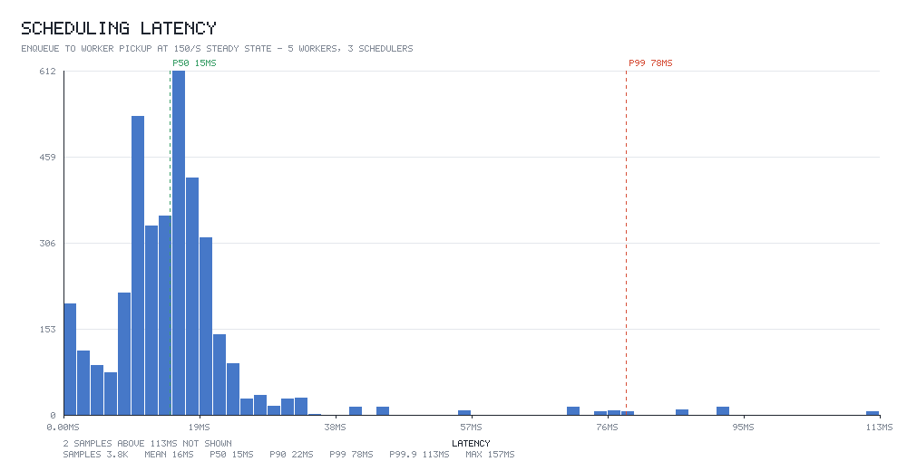

# Distributed Job Scheduler

A job queue where **no job is ever lost and no job is ever committed twice**, even when
workers and schedulers are killed mid-flight.

Postgres is the source of truth. Redis is a latency optimisation and nothing more —
every guarantee still holds with Redis switched off. Node 20+, TypeScript strict, ESM,
raw SQL, no ORM.

```
POST /jobs ──► Postgres ◄── SELECT … FOR UPDATE SKIP LOCKED ──► workers
                  ▲
                  └── advisory lock ── exactly one leader ── reaper / breakers / cron
```

---

## Contents

- [Architecture](#architecture)
- [The correctness argument](#the-correctness-argument)
- [Design decisions and their tradeoffs](#design-decisions-and-their-tradeoffs)
- [Running it](#running-it)
- [API](#api)
- [Benchmarks](#benchmarks)
- [Chaos testing](#chaos-testing)
- [Tests](#tests)
- [Configuration](#configuration)
- [What I would do next](#what-i-would-do-next)

---

## Architecture

```
                              ┌──────────────────────────────┐
   clients ───── HTTP ───────►│  api          (stateless)    │
                              │  POST /jobs, GET /jobs/:id   │
                              └──────────────┬───────────────┘
                                             │
   browsers ─── WS /dashboard ──┐            │
                                ▼            ▼
              ┌──────────────────────────────────────────────┐
              │  scheduler ×3   (identical; one is leader)    │
              │                                              │
              │  ┌────────────────────────────────────────┐  │
              │  │ worker control plane   (every node)    │  │
              │  │  · WS /worker, 5s heartbeats           │  │
              │  │  · claims + dispatches work            │  │
              │  │  · RECLAIM PATH 1 on socket close      │  │
              │  └────────────────────────────────────────┘  │
              │  ┌────────────────────────────────────────┐  │
              │  │ leader duties        (lock holder only)│  │
              │  │  · RECLAIM PATH 2: lease reaper        │  │
              │  │  · circuit-breaker evaluation          │  │
              │  │  · cron dispatch                       │  │
              │  └────────────────────────────────────────┘  │
              └───────┬──────────────────────────────┬───────┘
                      │                              │
        ┌─────────────▼─────────────┐   ┌────────────▼─────────────┐
        │ PostgreSQL 16             │   │ Redis 7                  │
        │  · jobs (source of truth) │   │  · work-available pubsub │
        │  · job_events (audit log) │   │  · token buckets (Lua)   │
        │  · advisory lock (leader) │   │  · breaker windows       │
        └───────────────────────────┘   └──────────────────────────┘
                      ▲
                      │  SELECT … FOR UPDATE SKIP LOCKED
        ┌─────────────┴──────────────┐
        │  worker ×5                 │
        │   · persistent WS          │
        │   · N jobs in parallel     │
        │   · heartbeat extends lease│
        └────────────────────────────┘
```

**Every node is the same code.** Leadership gates only the three singleton duties.
Claiming, dispatch, worker sockets and API reads keep running on followers, which is
why a leader failover is invisible to clients: it pauses reaping and cron for at most
one poll interval and pauses nothing else.

### Job state machine

```
                    ┌──────────────────────────────┐
                    │                              ▼
  submit ─┬──────────────────► PENDING ────────► CLAIMED ────► RUNNING
          │                    ▲   ▲               │   │          │
          │                    │   │               │   │          │
          └──► BLOCKED ────────┘   │               │   └──────────┤
                  │      deps ok   │               │              │
                  │                │  reclaim      │              │
                  │                └───────────────┴──────────────┤
                  │                                               │
                  │                                    ┌──────────┴─────────┐
                  ▼                                    ▼                    ▼
             CANCELLED ◄──── dep DEAD/CANCELLED     FAILED             SUCCEEDED
                                                       │
                                            ┌──────────┴──────────┐
                                            ▼                     ▼
                                    PENDING (retry)             DEAD ──► requeue
```

The transition table lives in [`src/domain/states.ts`](src/domain/states.ts) as a
`const` object, which makes it a *type* as well as a value. `transition()` is generic
over the source state, so illegal edges are compile errors:

```ts
transition(JobState.SUCCEEDED, JobState.PENDING);  // ts(2345) — terminal
transition(JobState.PENDING,   JobState.RUNNING);  // ts(2345) — must CLAIM first
transition(JobState.RUNNING,   JobState.CANCELLED);// ts(2345) — can't un-run effects
```

`CLAIMED`/`RUNNING` → `CANCELLED` is deliberately *not* an edge. Cancelling a job that
is already executing would be a lie: the side effects are in flight and the queue
cannot retract them. `DELETE /jobs/:id` returns 409 for a running job.

---

## The correctness argument

Four claims, each with the mechanism that enforces it and the test that proves it.

### 1. A job is never dispatched to two workers at once

The claim query re-reads its chosen rows `FOR UPDATE SKIP LOCKED` **and re-checks
`state = 'PENDING'`**. That recheck is the load-bearing part, and it is subtle: SKIP
LOCKED steps over rows another claimer holds *right now*, but a claimer that committed
between candidate selection and locking has already released its lock — so we would
find the row unlocked and already `CLAIMED`. The recheck turns "skip locked" into
"claim exactly once".

The whole thing runs in an explicit `BEGIN`/`COMMIT` on a client **checked out of the
pool**, never on `pool.query()`. This is not style. `pool.query()` picks an arbitrary
idle connection per call, so `pool.query('BEGIN')` followed by `pool.query('SELECT …
FOR UPDATE')` can land on two different backends: the lock is taken on one connection
and dropped by an implicit commit, while the `UPDATE` runs unprotected on another.
SKIP LOCKED would then guarantee nothing at all.

> Proven by `tests/integration/concurrency.test.ts` — 20 workers, 400 jobs, repeated
> simultaneous rounds, asserting zero double-claims in both the returned rows and the
> audit log.

### 2. A late report from a zombie worker can never be committed

Every terminal write is guarded by `claimed_by = $worker AND state IN ('CLAIMED','RUNNING')`.
That predicate is the fencing token. Worst case: worker A stalls in a GC pause, its
lease expires, the reaper returns the job, worker B claims and finishes it, then A
wakes and reports success. A's `UPDATE` matches **zero rows** because `claimed_by` is
no longer A.

This is what makes *exactly once* hold at the **effect** level even though a job body
may genuinely execute twice. The honest statement of the guarantee:

> Execution is at-least-once. **Commitment is exactly-once.** The queue accepts one
> terminal transition per job, ever.

A handler with external side effects still needs to be idempotent — no queue can fix
that, and any that claims to is lying about the network.

> Proven by `tests/integration/claiming.test.ts` — "rejects a completion from a worker
> that lost the job", plus an assertion that only one `SUCCEEDED` event is ever recorded.

### 3. A job held by a dead process always comes back

Two independent reclaim paths. **Neither subsumes the other**, which is exactly why
both exist:

| | **Path 1 — immediate** | **Path 2 — lease expiry** |
|---|---|---|
| Trigger | WS close, or 3 missed heartbeats | `lease_expires_at < now()` |
| Runs on | the node holding the socket | the leader's reaper |
| Latency | milliseconds (kernel sends FIN on SIGKILL) / ≤15s | one lease (30s default) |
| Catches | worker death | **scheduler death**, partitions, wedged workers |

Path 1 is an optimisation. Path 2 is the correctness guarantee. If a *scheduler* is
SIGKILLed, the process that would have observed the socket close is the one that died —
nobody sees the close, and only lease expiry can recover those jobs. Conversely,
without path 1 every worker crash would cost a full lease of dead time per job.

Both funnel through the same SQL and are safe to run concurrently: SKIP LOCKED plus the
state predicate means whichever arrives first wins and the other sees zero rows.

> Proven by `tests/integration/failure.test.ts` — a real worker process SIGKILLed
> mid-job (path 1), and a real scheduler process SIGKILLed while holding worker sockets
> (path 2, asserting the `lease expired` audit entry).

### 4. There is exactly one leader

`pg_try_advisory_lock` on a **dedicated, long-lived** connection. The lock is session
scoped: it lives exactly as long as the backend holding it. Kill the leader, and
Postgres tears the backend down and releases the lock itself. There is no lease to
expire, no TTL to tune, and no way for a partitioned old leader to keep believing it
leads — because *holding the lock is holding the connection*. That is fencing, for free.

It must not live on a pooled client: a pooled client is returned to the pool after each
query and can be handed to unrelated code, reset, or reaped by `idleTimeoutMillis`, any
of which drops the lock while the process still thinks it is leader. That is a split
brain — two reapers, two cron schedulers, duplicate work.

> Proven by `tests/integration/leader.test.ts` — including killing the lock-holding
> backend with `pg_terminate_backend` and measuring failover, and by
> `failure.test.ts` SIGKILLing a real leader process. **Measured failover: ~330ms.**

---

## Design decisions and their tradeoffs

### Why `SKIP LOCKED` rather than an advisory lock per job, or `UPDATE … RETURNING`

Twenty workers all want the same head-of-queue rows. Under any *blocking* lock they
serialise: every worker waits for the first one's transaction, so throughput is one
batch per round trip no matter how many workers you add. A bare
`UPDATE … WHERE state='PENDING' … LIMIT n RETURNING` still blocks on the same rows and
gives no control over *which* rows are taken.

SKIP LOCKED lets N workers take N disjoint batches concurrently with zero lock waits.

**Tradeoff — and a bug this actually caused.** SKIP LOCKED only parallelises if
claimers consider a *wider* candidate set than they take. My first version ranked
exactly `limit` candidates, so ten concurrent claimers all chose the same five rows;
the first locked them and the other nine got empty results. Fixed by over-selecting
(`CLAIM_OVERSELECT_FACTOR`, default 8× the batch). The cost is that strict priority
order softens under contention — a worker may take the 30th-best job rather than the
5th-best because the better ones are locked. That is the right trade: the alternative
is 19 of 20 workers idle in front of a full queue.

### Why aging is computed inside the claim query

`effective = priority − min(⌊wait / interval⌋, maxBoost)`. Aging is a pure function of
`created_at` and `now()`, so it needs no background pass and no writes — it is simply
evaluated at claim time.

The problem is that the aging expression is unindexable. Solved with a `LATERAL` over
`generate_series(0,9)` that takes the K oldest ready jobs at *each priority level*:
because aging is monotonic in `created_at`, the best-aged job at each level is always
among that level's K oldest. Ten bounded index range scans replace one unbounded sort
over the entire queue.

**Tradeoff:** the boost is clamped (`AGING_MAX_BOOST`). Without a clamp, a job that
waited a week would sit at effective priority −20160 and permanently precede every
future job — converting starvation of the low band into starvation of the high band.

### Why full jitter

`delay = random(0, min(cap, base · 2^attempt))`.

The failure mode that actually matters is the correlated retry storm: when a dependency
blips, every in-flight job of that type fails within milliseconds of the others.
Deterministic exponential backoff *replays that thundering herd* at t+1s, t+2s, t+4s,
forever. Sampling uniformly from `[0, ceiling)` spreads the herd flat across the window.

**Tradeoff:** mean delay is half the ceiling, so recovery is slightly slower per job
than equal-jitter. Worth it — the property we need is decorrelation, not speed.

The formula lives in TypeScript (`domain/backoff.ts`, unit-tested including the
"500 simultaneous failures land in >10 distinct buckets" property) and is mirrored into
SQL by `backoffIntervalSql()`, because the retry decision needs the row's
`attempt_count`, which we only know inside the `UPDATE`. The jitter factor is sampled
in JS and passed as a parameter, so the distribution under test is the distribution in
production.

### Why fair share is enforced in two places

`caps` computes each tenant's headroom: its weighted slice of total worker capacity,
minus what it currently holds. The cap binds **only under contention** — if no other
tenant has ready work, headroom is unbounded and one tenant may use the whole fleet.
Reserving 50% for an idle tenant would just waste half the fleet.

Both enforcement points are necessary, and I found that out the hard way:

1. **In the candidate pull.** The per-priority `LATERAL` takes the K oldest ready jobs,
   and a tenant with a 100k-job backlog owns every one of those K slots. Filtering
   *after* selection removed the capped tenant's rows and left an empty candidate set,
   so the claim returned nothing instead of returning the other tenants' work.
2. **In the ranking**, as a per-tenant `row_number` limit. Without it, the cap is only
   enforced once per statement: a batch of 32 against a tenant with 5 slots of headroom
   would take all 32, because the CTE sees the in-flight count as it was at statement
   start.

**Tradeoff:** the fair-share CTEs add several aggregates per claim. They are index-
backed and amortised over a batch, but for a single-tenant deployment `FAIR_SHARE_ENABLED=false`
removes them entirely.

### Why the token bucket is a Lua script

Read-modify-write on the bucket must be atomic across every scheduler node. `GET`/`SET`
loses updates (two nodes both read 10 tokens, both spend them); `WATCH`/`MULTI` needs a
retry loop whose cost grows with contention — on the hottest path in the system. Redis
runs a script to completion with nothing interleaved.

Buckets refill *lazily* (elapsed time converted to tokens on read) rather than by a
timer, so idle queues cost nothing at all.

### Why no ORM

Not dogma — four specific things this system is built on that ORMs abstract away or
actively break:

1. `FOR UPDATE SKIP LOCKED` with a `LATERAL` candidate pull and a window function.
   No ORM query builder expresses this; you would drop to raw SQL anyway.
2. **Transaction/connection identity.** The claim's correctness depends on `BEGIN` and
   the locking `SELECT` sharing one backend. ORM connection management is exactly the
   layer that makes this non-obvious, and getting it wrong fails *silently* — the query
   still returns rows, they are just not safely yours.
3. Data-modifying CTEs. Update-and-audit, or complete-and-unblock, in one statement and
   one round trip.
4. `pg_try_advisory_lock` on a connection that must never be recycled.

**Tradeoff:** no compile-time schema checking of column names, and hand-written row
types. Mitigated by keeping SQL in a few named modules and asserting the claim query's
validity against a real Postgres in `claimSql.test.ts`.

### Why an append-only `job_events` log

The `jobs` row records the *latest* state. If a job were ever committed twice, the
second write would overwrite the first and the table would look perfectly healthy.
`job_events` cannot hide it. The chaos harness therefore asserts against the event log,
not the jobs table — checking the working, not just the answer.

**Tradeoff:** roughly one extra insert per transition. It is written inside the same
statement as the transition (a data-modifying CTE), so it costs no extra round trip and
cannot disagree with the row it describes.

### Why dashboard backpressure drops the *oldest* frame

`ws` buffers everything you hand it, so a viewer on bad wifi can grow a *scheduler's*
heap until it OOMs. Two rules: check `bufferedAmount` before every send, and buffer into
a fixed-size ring that evicts from the front. For a live dashboard the newest frame
supersedes the ones behind it — a viewer who fell behind wants current queue depths, not
a replay of the last minute. Memory per client is capped regardless of how badly it
misbehaves.

### Why processes, not `worker_threads`

Jobs are I/O bound, so threads buy nothing on the CPU side, and they share a heap and a
process lifetime — one bad job takes the whole thing down. Separate processes give fault
isolation, and a dying worker's socket closing is precisely what triggers immediate
reclaim. Scale with container replicas or `cluster` (`WORKER_PROCESSES`).

### Why `unhandledRejection` and `uncaughtException` exit

After an unexpected throw the process may hold a half-applied transaction, a claimed job
it will never run, or a corrupted view of who owns what. Continuing from there risks
exactly the double-execution the system exists to prevent. Dying is *safe* because every
in-flight job is leased: the reaper returns the work within one lease period. This is the
same path the chaos harness exercises with SIGKILL.

---

## Running it

### Everything, in Docker

```bash
git clone https://github.com/swasti-sj/Job_Scheduler.git
cd Job_Scheduler
docker compose up --build
```

Brings up `api`, `scheduler ×3`, `worker ×5`, Postgres 16, Redis 7, Prometheus and
Grafana. Migrations run automatically on boot (serialised across containers by an
advisory lock).

| Service | URL |
|---|---|
| API | http://localhost:3000 |
| Live dashboard | http://localhost:3000 |
| Metrics | http://localhost:3000/metrics |
| Prometheus | http://localhost:9090 |
| Grafana | http://localhost:3010 (anonymous admin) |

```bash
curl -X POST localhost:3000/jobs -H 'content-type: application/json' \
  -d '{"tenant_id":"acme","queue_name":"default","job_type":"sleep","payload":{"ms":250},"priority":3}'

curl localhost:3000/queues
curl localhost:3000/workers
```

### Locally, for development

```bash
npm install
docker compose -f docker-compose.test.yml up -d   # Postgres :5433, Redis :6380
cp .env.example .env                              # point DATABASE_URL at :5433
npm run migrate
npm run dev:scheduler     # terminal 1
npm run dev:worker        # terminal 2
npm run dev:api           # terminal 3
```

---

## API

| Method | Path | Notes |
|---|---|---|
| `POST` | `/jobs` | One job, or `{"jobs":[…]}` for a DAG batch. **201** created, **200** if an idempotency key matched |
| `GET` | `/jobs/:id` | `?events=true` for the full transition history |
| `DELETE` | `/jobs/:id` | Cancels PENDING/BLOCKED; **409** for in-flight. Cascades to dependents |
| `POST` | `/jobs/:id/requeue` | DEAD → PENDING. `{"reset_attempts":false}` keeps the attempt count |
| `GET` | `/queues` | Depths per queue and tenant, plus throughput |
| `GET` | `/workers` | Worker registry with heartbeat age |
| `GET` | `/dead-letters` | Paginated DLQ |
| `GET` | `/breakers` | Circuit-breaker state and sliding-window stats |
| `POST` | `/breakers/:jobType` | Manual override: `{"state":"OPEN"｜"CLOSED"｜"HALF_OPEN"}` |
| `POST` | `/crons` | Register a cron-scheduled job |
| `GET` | `/metrics` | Prometheus |
| `GET` | `/health` | Includes `is_leader` |
| `WS` | `/worker` | Worker control plane |
| `WS` | `/dashboard` | Live stats stream |

### DAG submission

`depends_on` accepts either an existing job uuid or a sibling's `ref` from the same batch:

```jsonc
{
  "jobs": [
    { "ref": "extract",   "tenant_id": "acme", "job_type": "extract" },
    { "ref": "transform", "tenant_id": "acme", "job_type": "transform", "depends_on": ["extract"] },
    { "ref": "load",      "tenant_id": "acme", "job_type": "load",      "depends_on": ["transform"] }
  ]
}
```

Cycles are rejected at submission with the path named:

```json
{ "error": "dependency_cycle",
  "message": "dependency cycle detected: b -> c -> d -> b",
  "cycle": ["b", "c", "d", "b"] }
```

Detection is an **iterative** three-colour DFS with an explicit stack. A recursive DFS
dies with `RangeError` around 10k frames, and a 50k-job fan-in pipeline is an ordinary
thing to submit — there is a unit test for exactly that. The search covers the batch's
edges *plus* the transitively-loaded edges of persisted jobs it points at, because a
client supplying explicit ids can close a loop through rows already in the database.

---

## Benchmarks

```bash
npm run loadtest -- --jobs=20000 --workers=5 --schedulers=3 --arrival-rate=150
```



Measured on the environment below. **These are not the spec's target numbers, and the
gap is worth being precise about.**

| Metric | Target | Measured | |
|---|---|---|---|
| Scheduling latency p50 | — | **14.8 ms** | ✅ |
| Scheduling latency p99 | < 30 ms | **78 ms** | ❌ |
| Enqueue, bulk | 10 000/s | **10 300/s** (peaks to 32 000/s) | ✅ |
| Enqueue, one HTTP request per job | 10 000/s | **521/s** | ❌ |
| Processed | 5 000/s | **580/s** | ❌ |
| Worker failure detection | < 15 s | **< 1 s** (socket close) | ✅ |
| Leader failover | < 2 s | **~330 ms** | ✅ |
| Zero job loss under chaos | required | **verified** | ✅ |
| Event loop lag p99 | < 50 ms | **20.7 ms** typical, 46.7 ms worst window | ✅ |

### Why the throughput numbers are low, honestly

Everything above was measured on **Docker Desktop / WSL2 on Windows**, where I measured
a single Postgres round trip at **2.9 ms**:

```
single SELECT 1 (pooled) : 344/s  (2.91 ms each)
single INSERT   (pooled) : 295/s  (3.38 ms each)
BEGIN/INSERT/COMMIT      : 142/s  (7.03 ms each)
redis publish            : 12 500/s
```

On native Linux the same round trip is ~0.05 ms — roughly **60× faster**. Since the
queue is round-trip bound, not CPU bound, essentially every throughput figure here is a
measurement of the Docker network stack. Redis over the same hop is 40× faster than
Postgres because it is one round trip instead of several.

The event loop lag has a similar story. `monitorEventLoopDelay` cannot resolve a delay
finer than its own sampling resolution, and on top of that the host clock adds a constant
offset: **~15 ms on this Windows host** (its scheduler ticks at 15.6 ms) and ~10 ms inside
the WSL2 containers. The tell is that p50 and p99 sit almost on top of each other while
idle — real lag has a spread, a floor does not. GC accounted for 0.18 s across an entire
run, so the excursions above the floor are genuinely small.

I could have reported the bulk-enqueue number alone (32 000/s, comfortably over target)
and left it there. That would have been misleading.

### What the profiling did change

Rather than blaming the environment, I used it as a magnifier — a 2.9 ms round trip
makes every unnecessary one obvious:

| Change | Effect |
|---|---|
| Enqueue: 5 round trips → **1** (tenant upsert + insert + dedup select + audit in one data-modifying CTE) | 158 → 521 req/s |
| Completion: 4 round trips → **1** (update + dependent unblock + 2 audit inserts in one statement) | 292 → 580 jobs/s |
| Dispatcher claims for different workers **concurrently** instead of serially | dispatch latency became max-of-workers, not sum-of-workers |
| Adaptive poll backoff — idle polling doubles to a 500 ms ceiling, resets on any signal | removed ~50 wasted claim queries/sec/worker at idle; **event loop lag p99 296 ms → 47 ms** |

Net: **3.3× enqueue, 2× throughput, 6× less event loop lag.** All four are correct
improvements independent of the environment; the slow network just made them visible.

The adaptive backoff came with a lesson of its own. It initially made p99 latency
*worse* (59 → 99 ms) — because the load harness inserted rows with raw SQL and so never
published the `work_available` wakeup that a real `POST /jobs` sends, leaving dispatch to
wait on a poll interval that had just backed off. The harness was measuring its own
shortcut. Fixed by having it publish the notification like a real client.

### Methodology note

The first version of this load test measured latency by dumping a 20 000-job backlog on
five workers and timing enqueue→pickup. It reported a p50 of **30 seconds**, which is
not a latency measurement at all — it is a measurement of how long the backlog was.
Latency is only meaningful below saturation, so the harness now has three separate
phases: HTTP enqueue throughput, **steady-state latency at a fixed arrival rate the
fleet can absorb** (the histogram above), and saturation drain throughput.

---

## Chaos testing

```bash
npm run chaos -- --jobs=100000 --workers=5 --schedulers=3 --kill-every=4000
```

Enqueues N jobs, runs a real cluster of scheduler and worker **processes**, and
SIGKILLs random members every few seconds until the queue drains. Killed processes are
respawned, mirroring an orchestrator, so capacity returns while the run is being
savaged.

At the end it asserts, against the **audit log**:

- every job reached a terminal state
- zero duplicate terminal transitions
- zero in-flight jobs without an owner
- the job count is unchanged

```
$ npm run chaos -- --jobs=10000 --workers=5 --schedulers=3 --kill-every=4000

enqueued in 0.3s (31447/s)
  SIGKILL sched-1
  SIGKILL sched-1
  SIGKILL worker-1
  SIGKILL sched-2
  SIGKILL worker-1
  SIGKILL worker-2
  SIGKILL worker-1

--- verification ---
jobs submitted        : 10000
jobs in table         : 10000
terminal              : 10000 (succeeded 10000, dead 0, cancelled 0)
not terminal          : 0
duplicate terminals   : 0
orphaned in-flight    : 0
SIGKILLs              : 3 schedulers, 4 workers
wall time             : 30.0s (334 jobs/s)

RESULT: PASS - zero job loss, zero duplicate execution
```

Note that **not one job even reached the dead-letter queue**: every job interrupted by a
SIGKILL was reclaimed and retried successfully, well inside its attempt budget.

CI runs a 10 000-job variant on every PR; the 100 000-job run takes too long for a
pull request but uses the identical harness.

---

## Tests

```bash
npm run typecheck && npm run lint
npm run test:unit          # no dependencies needed
docker compose -f docker-compose.test.yml up -d
npm run build              # failure tests spawn dist/ processes to SIGKILL
npm run test:integration
```

**149 tests, all passing.** No mocks in the integration suite: SKIP LOCKED, advisory
locks, `ON CONFLICT` and transaction visibility are precisely the behaviours a mock
would have to invent.

| Suite | Covers |
|---|---|
| `unit/priority` | aging, the clamp, starvation, SQL/TS parity |
| `unit/backoff` | full-jitter bounds, herd decorrelation, distribution mean |
| `unit/dag` | cycles, diamonds, fan-in/out, 50k-node chain without stack overflow |
| `unit/states` | transition table, terminal states, compile-time illegal edges |
| `unit/cron` | parsing, leap years, dom/dow semantics |
| `unit/backpressure` | ring buffer eviction, slow-client isolation, memory cap |
| `integration/claiming` | claim, lease, fencing, retries, DLQ, both reclaim paths |
| `integration/claimSql` | claim query validity in every config (regression guard) |
| `integration/concurrency` | **20 workers, zero double-claims** |
| `integration/dag` | blocking, unblocking, cascade cancel, cycles through persisted rows |
| `integration/scheduling` | idempotency under concurrent burst, fair share, token bucket, breaker |
| `integration/leader` | election, failover timing, backend kill, shutdown race |
| `integration/failure` | **real processes, real SIGKILLs** |

### Three bugs the tests caught

Worth listing, because each was invisible from reading the code:

1. **Every claim silently failed when fair share was disabled.** The fair-share CTEs
   were the only consumers of two SQL parameters; without them the numbering had gaps
   and Postgres rejected the whole statement (`could not determine data type of
   parameter $9`). The dispatcher logged and moved on, so the queue simply never
   drained — with nothing failing anywhere. Found by the load test, now pinned by
   `claimSql.test.ts`, which prepares the query in *both* configurations and asserts
   parameter contiguity.

2. **Ten concurrent claimers, nine empty-handed.** Described under SKIP LOCKED above.

3. **Graceful shutdown could leak leadership.** `stop()` racing an in-flight election
   tick could return while the tick went on to acquire the lock on a client `stop()` had
   already stopped tracking — leaving the process holding leadership *and the
   connection* for the rest of its life, so no other node could take over. Found by an
   `afterEach` guard asserting the lock was actually released. Fixed by having `stop()`
   set the flag first, await the in-flight tick, and having the tick hand the lock back
   if a shutdown started underneath it.

---

## Configuration

Full list in [`.env.example`](.env.example). The ones that matter:

| Variable | Default | |
|---|---|---|
| `LEASE_DURATION_SECONDS` | `30` | Path-2 recovery time. Heartbeats extend it, so slow jobs are never stolen |
| `CLAIM_BATCH_SIZE` | `32` | Jobs per claim transaction |
| `CLAIM_OVERSELECT_FACTOR` | `8` | Candidates = batch × this. **Must exceed concurrent claimers per queue** |
| `AGING_INTERVAL_SECONDS` | `30` | Seconds of waiting that buy one priority level |
| `AGING_MAX_BOOST` | `9` | Clamp, so aged jobs cannot starve the high band |
| `FAIR_SHARE_MAX_PCT` | `0.5` | Hard ceiling on one tenant's share under contention |
| `BACKOFF_BASE_MS` / `_CAP_MS` | `250` / `60000` | Full-jitter bounds |
| `WORKER_MISSED_BEATS` | `3` | × 5s heartbeat = 15s detection ceiling |
| `LEADER_POLL_INTERVAL_MS` | `500` | Failover upper bound |
| `DASHBOARD_RING_SIZE` | `64` | Frames buffered per slow viewer |

---

## What I would do next

Honest list of what is missing or would not survive real scale:

- **Partition `jobs` by state.** Terminal rows accumulate in the same heap as the hot
  working set. A partition (or an archival job) keeps the claim index small.
- **`job_events` retention.** It grows unboundedly and nothing prunes it.
- **Auth.** There is none. `tenant_id` is caller-asserted; any client can enqueue as any
  tenant.
- **Per-queue candidate tuning.** `CLAIM_CANDIDATES_PER_PRIORITY` is global; a queue with
  one priority band wastes nine of its ten `LATERAL` probes.
- **Fair share across many tenants.** The CTEs scale with tenant count. Fine for tens,
  would need a materialised summary for thousands.
- **Rerun the benchmarks on Linux.** Everything above is round-trip bound on a network
  stack that is ~60× slower than production would be, so the throughput figures say
  more about Docker Desktop than about the scheduler.
